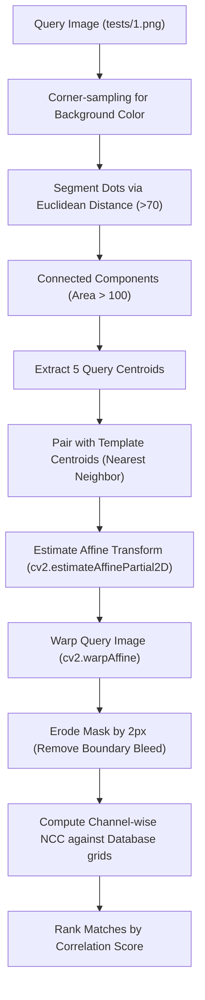

# Implementation Plan - Phase 2: Web App Frontend (OpenCV.js & NCC Matching)

Build the interactive client-side web application using HTML5 canvas, OpenCV.js, and Normalized Cross-Correlation (NCC) pixel-space matching.

---

## 1. How the Python Affine Warp and NCC System Works

The Python-based matching pipeline we verified in Phase 1 consists of the following steps:



1. **Dynamic Background Detection:**
   - Samples 4 corners of the query image ($10 \times 10$ pixels each) and averages them to find the true background color dynamically. This makes the system robust to camera lighting, color shifts, and glare.
2. **Dot Segmentation:**
   - Computes the Euclidean distance of each pixel in the query image from the detected background color.
   - Pixels with a distance greater than 70 are segmented as dots (binary mask).
3. **Centroid Extraction & Filtering:**
   - Runs OpenCV's connected components to extract stats and centroids.
   - Filters out noise by ignoring components with an area smaller than 100 pixels.
   - Selects the top 5 largest components as the query dots.
4. **Centroid Alignment (Nearest Neighbor):**
   - For each of the 5 ideal template centroids, finds the closest query centroid. This orders the query dots consistently (Top-Left, Top-Right, Center, Bottom-Left, Bottom-Right) and makes the mapping robust to rotation or scaling.
5. **Affine Warping:**
   - Estimates the partial affine transform matrix (scale, rotation, translation) between the ordered query centroids and the template centroids.
   - Warps the query image using this matrix, resulting in a perfectly aligned $224 \times 224$ query image.
6. **Eroded Masking & NCC Matching:**
   - Crops patches around the centroids and applies a circular mask eroded by 2 pixels. This completely hides the query's original background and avoids edge color leakage.
   - Computes **Normalized Cross-Correlation (NCC)** over the R, G, B channels of the query dots vs. reference database dots:
     $$NCC(A, B) = \frac{\sum (A - \bar{A})(B - \bar{B})}{\sqrt{\sum (A - \bar{A})^2 \sum (B - \bar{B})^2}}$$
   - Centering each patch channel independently makes the score invariant to changes in display brightness, contrast, and color balance.

---

## 2. Proposed Changes for Phase 2

### Database Optimization & Packaging

#### [NEW] [build_patches_db.py](file:///c:/Users/haven/code/jacket_search/deep_learning/build_patches_db.py)
To prevent the client browser from downloading 2,208 large jacket images or a 45MB JSON file, we will compile the patch grids ($120 \times 80$ pixel grids containing only the 5 dot regions) of all jackets into a single **compact binary database file** `patches_db.bin` (~3.5 MB):
1. For each of the 2,208 jackets, crop the 5 patches and assemble them into a $120 \times 80$ grid.
2. Compress the grid image as a JPEG (Quality 75, typically ~1.5 KB).
3. Write a binary structure to `deep_learning/patches_db.bin`:
   - `total_items` (`uint32` - 4 bytes)
   - For each item:
     - `name_length` (`uint16` - 2 bytes)
     - `jacket_name` (UTF-8 String)
     - `jpeg_length` (`uint32` - 4 bytes)
     - `jpeg_bytes` (Binary Data)

---

### Web App Frontend Integration

#### [MODIFY] [index.html](file:///c:/Users/haven/code/jacket_search/index.html)
Add the official CDN script tag for OpenCV.js (WebAssembly compiled OpenCV) to enable high-speed connected components, affine transforms, and warping in the browser:
```html
<script src="https://docs.opencv.org/4.5.0/opencv.js" async></script>
```

#### [NEW] [app.js](file:///c:/Users/haven/code/jacket_search/app.js)
The core web app javascript script:
1. **Database Loader:**
   - Fetches `patches_db.bin` and parses the binary buffers using `ArrayBuffer` and `DataView`.
   - Decodes each JPEG grid in the background using browser-native `createImageBitmap` or `OffscreenCanvas`.
   - Caches the decoded grid pixels as `Float32Array`s (channel-wise) to enable sub-millisecond NCC comparisons on every webcam frame.
2. **Camera & Capture Stream:**
   - Uses `navigator.mediaDevices.getUserMedia` to feed the camera stream into `<video>`.
   - Projects the feed onto a hidden processing canvas at 15+ FPS.
3. **OpenCV.js Processing & Affine Alignment:**
   - When OpenCV.js loads, runs the corner background sampling and dynamic distance thresholding.
   - Extracts centroids via `cv.connectedComponentsWithStats`.
   - Maps the detected centroids to the active template mask (5-dot, 3-dot, or 1-dot).
   - Warps the frame using `cv.estimateAffinePartial2D` and `cv.warpAffine` to align it perfectly.
4. **Real-time NCC Engine:**
   - Extracts the aligned dot regions, applies the circular eroded mask, and computes NCC against all 2,208 cached reference grids.
   - Updates the UI card with the top 5 matches, including similarity progress bars.
   - Renders the debug visual comparison canvas showing the aligned query grid side-by-side with the matching reference grid.

---

## Verification Plan

### Automated Tests
- Run `build_patches_db.py` to compile `patches_db.bin`.
- Write a node-based parser check or check file size.

### Manual Verification
- Deploy locally using a web server (e.g. VS Code Live Server or Python's `http.server`).
- Load `index.html` in Chrome/Firefox.
- Verify that the camera stream loads correctly, the database is parsed and decoded successfully, and uploading `tests/1.png` to `4.png` resolves to their correct jackets at Rank #1 in real-time.
